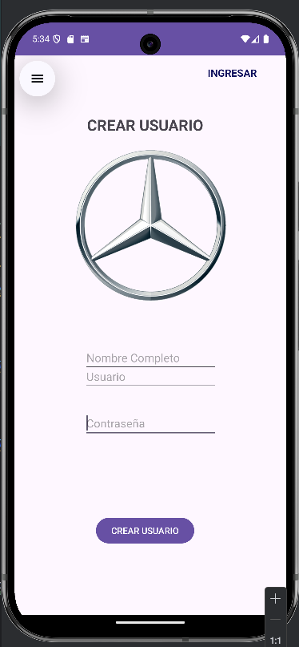
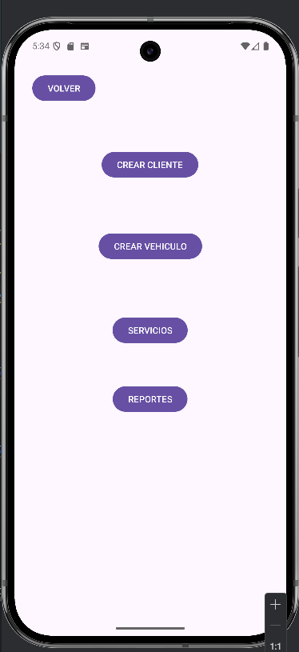
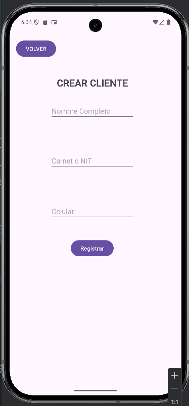
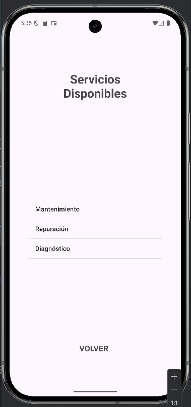
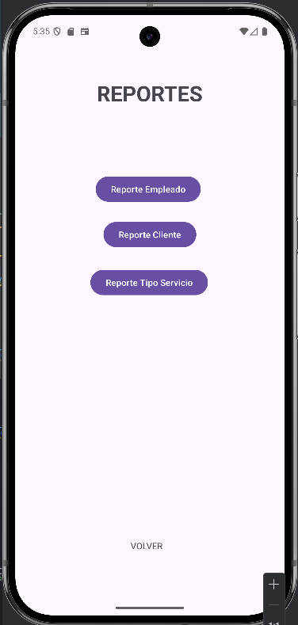

# 📱 Final - Android App

<p align="left">
  
  
  
  
</p>

Proyecto Android desarrollado en **Kotlin** con Android Studio.

## 🚀 Características
- Arquitectura modular y uso de Gradle.
- Persistencia de datos: **SQLite (SQLiteOpenHelper)**.
- Compatibilidad: compileSdk **34**, targetSdk **34**, minSdk **33**.

## 🛠️ Tecnologías
- Android Studio • Kotlin
- Gradle
- SQLite
- Git & GitHub

## 📂 Estructura del proyecto (resumen)
```text
Final/
  ├─ app/
    ├─ src/
    ├─ .gitignore
    ├─ build.gradle.kts
    ├─ proguard-rules.pro
  ├─ gradle/
    ├─ wrapper/
    ├─ libs.versions.toml
  ├─ .gitignore
  ├─ build.gradle.kts
  ├─ gradle.properties
  ├─ gradlew
  ├─ gradlew.bat
  ├─ settings.gradle.kts
```

## 🖼️ Capturas de pantalla

| Inicio | Creacion Usuario | Opciones |
|--------------------------------|--------------------------------------------|--------------------------------------|
|  |  |  |

| Crear Cliente                           | Crear Vehiculo                            |
|-----------------------------------------|-------------------------------------------|
|  |  |

| Servicios                            | Reportes                            |
|--------------------------------------|-------------------------------------|
|  |  |

## ⚙️ Configuración y ejecución
1. Clona el repositorio:
   ```bash
   git clone https://github.com/Timosboy/VehicleServiceManager
   ```
2. Abre el proyecto en **Android Studio**.
3. Sincroniza dependencias con **Gradle** y selecciona un dispositivo/emulador.
4. Ejecuta la app con ▶️ *Run*.

## 🧪 Pruebas
- Ejecuta tests desde **Android Studio** → *Run tests* o con Gradle:
  ```bash
  ./gradlew test
  ```

## 📦 Build
- Genera un APK:
  ```bash
  ./gradlew assembleDebug
  ```


## 🚀 Características
- Registro, edición y eliminación de clientes.
- Asociación de vehículos a cada cliente.
- Registro de servicios realizados a los vehículos.
- Generación de reportes por cliente, vehículo o tipo de servicio.
- Persistencia local con SQLite.


## 🧭 Roadmap

- [ ] Agregar pruebas unitarias e instrumentadas
- [ ] Migrar a Room
- [ ] Modo oscuro
- [ ] Internacionalización (ES/EN)
- [ ] CI con GitHub Actions

## 🤝 Contribuir

1. Haz un fork
2. Crea una rama: `git checkout -b feature/mi-mejora`
3. Commit: `git commit -m "feat: agrega X"`
4. Push: `git push origin feature/mi-mejora`
5. Abre un Pull Request

## 📝 Notas

- Si usas emulador, activa **Use detected ADB location** en *Settings → Tools → SDK* y verifica `adb devices`.
- Para dispositivos físicos, activa **Depuración USB** y **Instalar vía USB** en opciones de desarrollador.

## 🪪 Licencia
Este proyecto se distribuye bajo licencia **MIT** (ver `LICENSE`).

## 👤 Autor
**Paul Timothy Kuno Serrano**  
Cochabamba, Bolivia  
Correo: juchpaul20@gmail.com